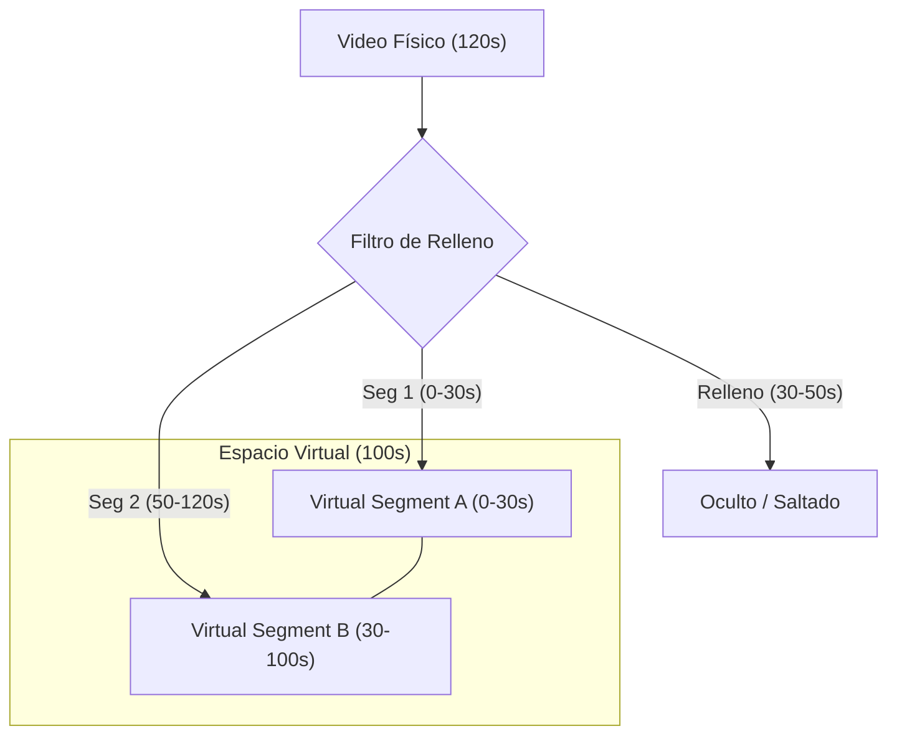

# Klip — Análisis de Entrevistas

Klip es un editor de video diseñado específicamente para el **análisis de entrevistas laborales**. Optimice su proceso de selección identificando competencias clave y filtrando el tiempo muerto con precisión.

### 1. ¿Qué es el tiempo virtual?

El tiempo virtual es una abstracción temporal donde las secciones marcadas como "Relleno" han sido eliminadas lógicamente de la línea de tiempo.

- Para el usuario, el video es continuo y más corto.
- Si el video dura 120s y hay 20s de relleno, la **Duración Virtual** es 100s.
- Implementamos funciones de transformación: `toVirtualTime(real)` y `toRealTime(virtual)` que proyectan cualquier punto de un plano al otro restando o sumando los huecos acumulados.

### 2. ¿Cómo se definen los puntos de corte?

Los límites de navegación se calculan dinámicamente en el espacio virtual. Recolectamos todos los hitos de inicio y fin de cada etiqueta de competencia, además del inicio y final del video virtual. Estos puntos se almacenan en una lista ordenada que sirve como guía para los saltos de navegación.

### 3. ¿Por qué la navegación es correcta incluso con solapamientos?

La navegación es robusta ante solapamientos porque cada límite de etiqueta se trata como un hito independiente en nuestra lista de "puntos de corte". Al presionar las flechas, el sistema simplemente busca el hito más cercano en la dirección deseada, sin importar a qué etiqueta pertenece.

### 4. Diagrama del Modelo Temporal



## Características principales

- **Etiquetado de competencias**: Identifique y marque comportamientos específicos y habilidades blandas en tiempo real.
- **Salto automático de relleno**: Omita con un solo clic las partes marcadas como relleno (silencios, muletillas o diálogos irrelevantes) durante la reproducción.
- **Métricas de la entrevista**: Desglose instantáneo de tiempo de valor frente a tiempo de relleno.
- **Navegación precisa**: Línea de tiempo de alta precisión y navegación por límites de segmentos para saltar entre momentos clave.
- **Onboarding integrado**: Tour interactivo integrado para capacitar al equipo de selección en segundos.

## Tecnologías utilizadas

- **Framework**: [React 19](https://react.dev/)
- **Herramienta de construcción**: [Vite](https://vitejs.dev/)
- **Estilos**: [Tailwind CSS 4](https://tailwindcss.com/)
- **Animaciones**: [Framer Motion](https://www.framer.com/motion/)
- **Lenguaje**: [TypeScript](https://www.typescriptlang.org/)

## Inicio rápido

### Requisitos previos

- [Node.js](https://nodejs.org/) (Se recomienda la versión LTS más reciente)
- [npm](https://www.npmjs.com/) o [bun](https://bun.sh/)

### Instalación

1. Clone el repositorio:

   ```bash
   git clone https://github.com/IvyedSG/klip.git
   cd klip
   ```

2. Instale las dependencias:

   ```bash
   npm install
   ```

3. Inicie el servidor de desarrollo:
   ```bash
   npm run dev
   ```

### Construcción para producción

```bash
npm run build
```

_Transforme su flujo de trabajo de selección con Klip._
